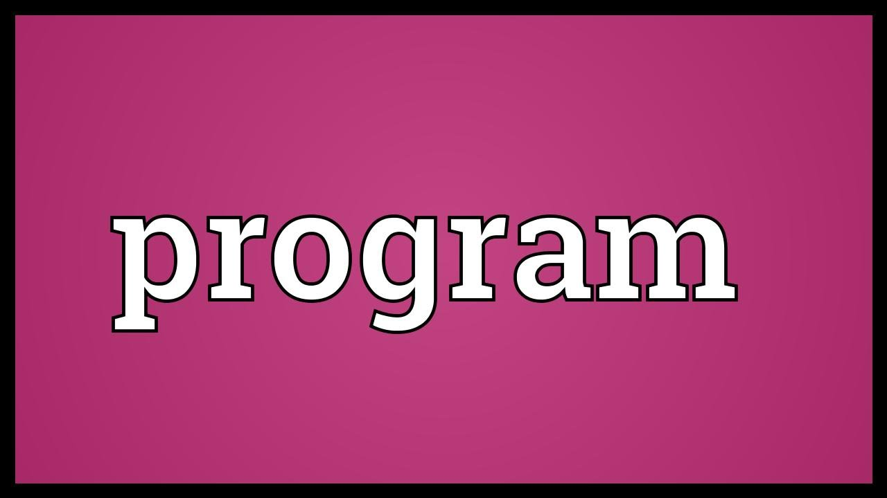

# Example Project
[](https://opensource.org/licenses/MIT)
## Description
This is a little about the project
```hello world```
## Contents
- [Installation]("#installation")
- [Usage]("#usage")
- [How to Contribute]("#how-to-contribute")
- [Credits]("#credits")
- [License]("#license")
## Installation
- step one
- step two
## Usage

## Questions
If you have any questions about using or contibuting to the project, you can contact me via email or though github:
- Email: example@gmail.com
- Github: [@jkohrt7](https://github.com/jkohrt7)
## Credits
- [Jared Kohrt ](https://www.github.com/jkohrt7) 
- [inquirer ](https://www.google.com) 
## License
[MIT](https://opensource.org/licenses/MIT)
